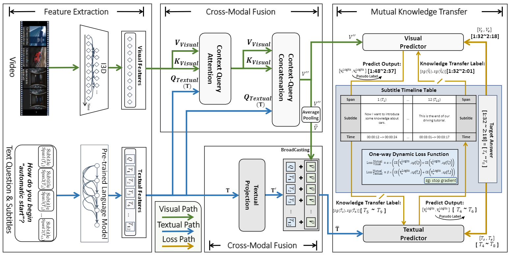

# MutualSL


- 2022/10/28 updates codes 🏆

## Main Method



###### we propose a novel cross-modal mutual knowledge transfer span localization (MutualSL) method to reduce the cross-modal knowledge deviation shown in Fig.~\ref{sample2}(d). Specifically, the MutualSL uses both visual predictor and textual predictor, where these two predictors have different prediction targets so that they have different strength perceptions of different-modal information. We expect that these two predictors can enhance the information perception of their own modal. Each predictor needs to predict the output value of another predictor on the basis of the target answer in the training stage. Then we design a one-way dynamic loss function (ODL) to dynamically adjust the knowledge transfer, which can alleviate the difference of cross-modal knowledge transferring in the training process.

## Prerequisites

- python 3.7 with pytorch (`1.10.0`), transformers(`4.15.0`), tqdm, accelerate, pandas, numpy, glob, sentencepiece
- cuda10/cuda11

#### Installing the GPU driver

```shell script
# preparing environment
sudo apt-get install gcc
sudo apt-get install make
wget https://developer.download.nvidia.com/compute/cuda/11.5.1/local_installers/cuda_11.5.1_495.29.05_linux.run
sudo sh cuda_11.5.1_495.29.05_linux.run
```

#### Installing Conda and Python

```shell script
# preparing environment
wget -c https://repo.continuum.io/miniconda/Miniconda3-latest-Linux-x86_64.sh
sudo chmod 777 Miniconda3-latest-Linux-x86_64.sh 
bash Miniconda3-latest-Linux-x86_64.sh

conda create -n mutualsl python==3.7
conda activate mutualsl
```

#### Installing Python Libraries

```plain
# preparing environment
pip install torch==1.10.0+cu113 torchvision==0.11.1+cu113 torchaudio==0.10.0+cu113 -f https://download.pytorch.org/whl/cu113/torch_stable.html
pip install tqdm transformers sklearn pandas numpy glob accelerate sentencepiece
```

## Data

Download the **MedVidQA** dataset from [here ](mailto:wengsyx@gmail.com?subject=Get%20MedVidCQA%20Dataset)

Download the **TutorialVQA** dataset from [here ](mailto:wengsyx@gmail.com?subject=Get%20TutorialVQA%20Dataset)

Download the **VehicleVQA** dataset from [here ](mailto:wengsyx@gmail.com?subject=Get%20VehicleVQA%20Dataset)


place them in `./data` directory.

## Quick Start

### Get Best

```shell script
python main.py
```

> All our hyperparameters are saved to  `run.sh` file, you can easily reproduce our best results.


### Files

```shell script
-- data
-- paperlog

-- main.py
-- model.py


```


### contributions

- we propose the MutualSL method, which for the first time uses two different predictors in VAL tasks meanwhile, and uses a Look-up Table to achieve cross-modal knowledge transfer; 
- We design ODL to dynamically adjust the knowledge transfer, which can alleviate the differences in knowledge transfer between different predictors
- We have conducted extensive experiments to prove the effectiveness of the MutualSL, where results show that the proposed method outperforms all other competitive SOTA methods in VAL tasks.

## Cite

```
@article{weng2022visual,
  title={Visual Answer Localization with Cross-modal Mutual Knowledge Transfer},
  author={Weng, Yixuan and Li, Bin},
  journal={arXiv preprint arXiv:2210.14823},
  year={2022}
}

```
